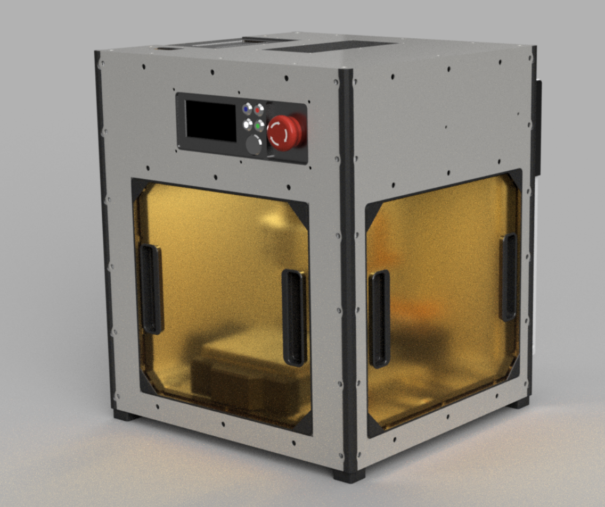

# OZ, Portable CNC Machine
Portable CNC machine schematics, CAD plans and software. OZ CNC includes embedded vacuum motor, lights, realtime display and rigid case, capable of aluminium cutting.




## Specifications
Working area: **80x110 mm** (parametric)

Z working area: **50mm**

Spindle: **12000RPM**

## Build details
You can find PCBs in [pcb](/pcb) folder (DipTrace).
CAD files in Fusion 360 format are [here](fusion360/OZ_v5.f3z).

## Software
OZ CNC includes multiple applications you'll have to build and install.

### CNC.js
The main machine board works using CNC.js, you can find more details about it [here](https://cnc.js.org/).

### GRBL
Machine controller could be implemented using any compatible [ESP32-GRBL](https://github.com/bdring/Grbl_Esp32) board or similar.

### CNC.js Pedant
Realtime position tracking done using pendant (plugin, for normal people) implemented on Golang.details

To build pedant:

```
$ cd software/pendant
$ go vendor tidy
$ go build cmd/display/main.go
```

To launch pendant:
```
$ ./main -h localhost:8000 -u username -p password
```

### Display
Display runs on Arduino.Pro, it's source code located in `software/display`.

Where h, u, p are hostname, username and password for CNC.js.

# LICENSE
MIT, see [LICENSE](LICENSE.md).
